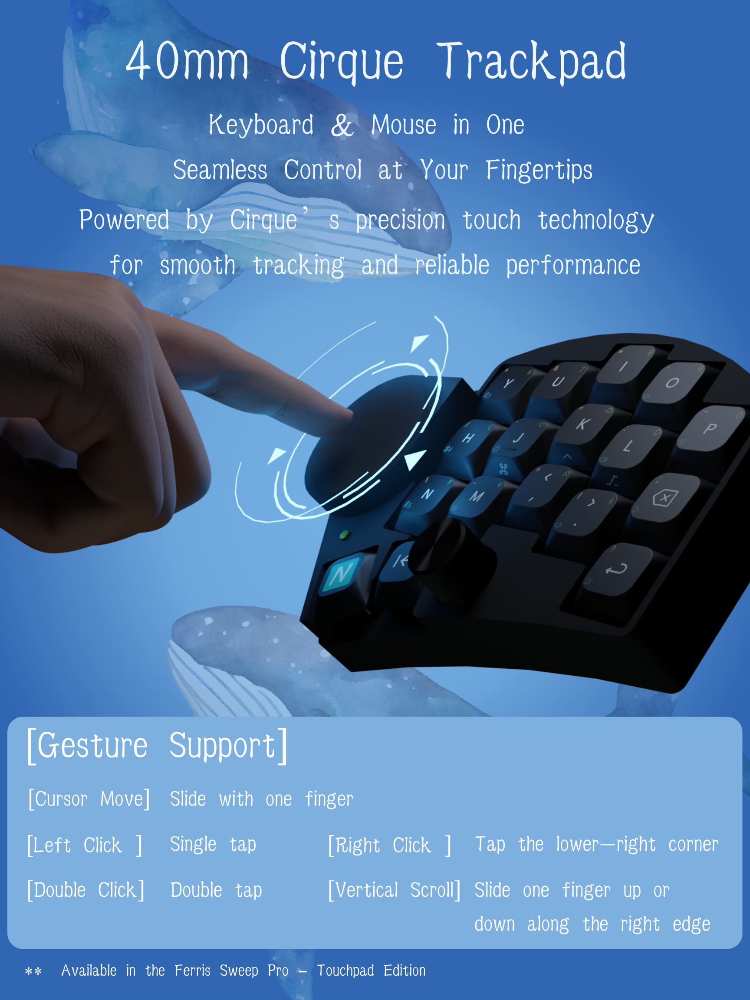

# Cirque Pinnacle Input Module for Zephyr

A high-performance **Zephyr Module** providing a specialized driver for the **Cirque Pinnacle (1CA027)** touch controller. Optimized for ZMK and custom mechanical keyboards.

> [!IMPORTANT]
> This repository is **forked from [petejohanson/cirque-input-module](https://github.com/petejohanson/cirque-input-module)**. 
> We have extended the original driver to include integrated gesture recognition for a more seamless keyboard-integrated mousing experience.

---

## ✨ Key Features: Integrated Gestures

This module features **on-device gesture recognition**, allowing you to perform common mouse operations directly on your trackpad without needing additional key layers:

* **🖱️ Cursor Movement:** Smooth, high-resolution tracking with a single finger.
* **Left Click:** Single tap anywhere on the trackpad surface.
* **Double Click:** Rapid double tap to open files or select text.
* **Right Click:** Tap the **bottom-right corner (5 o'clock position)** to trigger the context menu.
* **Vertical Scroll:** Slide along the **right edge** of the trackpad for fluid, silk-smooth page scrolling.



---

## 🚀 Installation & Usage

### 1. Add to your `west.yml`
To use this enhanced version in your ZMK/Zephyr build, add this project to your manifest:

```yaml
manifest:
  remotes:
    - name: nxtkb
      url-base: https://github.com/nxtkb
  projects:
     - name: cirque-input-module
       remote: nxtkb
       revision: main
```


### 2. Configuration
Enable the I2C and the driver in your prj.conf:

```conf

# i2c
CONFIG_I2C=y
CONFIG_I2C_NRFX=y

# pointing device
CONFIG_ZMK_POINTING=y
CONFIG_ZMK_POINTING_SMOOTH_SCROLLING=y
CONFIG_INPUT_THREAD_STACK_SIZE=4096

```


### 3. Device Tree Configuration
Update your `glidepoint` node by replacing the `compatible` property with `cirque,pinnacle2`:

```devicetree

&i2c0 {
	compatible = "nordic,nrf-twim";  /* I2C controller instead of generic */
	status = "okay";
	
	pinctrl-0 = <&i2c0_default>;
	pinctrl-1 = <&i2c0_sleep>;
	pinctrl-names = "default", "sleep";
	
	clock-frequency = <400000>;
	
	glidepoint: glidepoint@2a{
		compatible = "cirque,pinnacle2"; /* Updated from "cirque,pinnacle" */
		reg = <0x2a>;
		status = "okay";
		data-ready-gpios = <&gpio0 22 (GPIO_ACTIVE_HIGH)>;
		sensitivity = "2x";
		data-mode = "relative";
		primary-tap-enable;
		sleep-mode-enable;
		invert-y;
	};
};

```


---

## 🛠️ Hardware Compatibility
Controller: Cirque Pinnacle 1CA027 (GlidePoint)

Connectivity: I2C (Default), SPI

Tested On: Sweep-Pro with nice!nano v2

---

## 📚 Resources
For more information on integrating pointing devices and hardware development with ZMK, please refer to:

ZMK Official Documentation: [Hardware Integration - Pointing](https://zmk.dev/docs/development/hardware-integration/pointing)


---
## 🙏 Credits
Special thanks to [Pete Johanson](https://github.com/petejohanson/cirque-input-module) for the original implementation of the Cirque Pinnacle driver for Zephyr. This fork aims to build upon that solid foundation to provide advanced UX features for the split keyboard community.